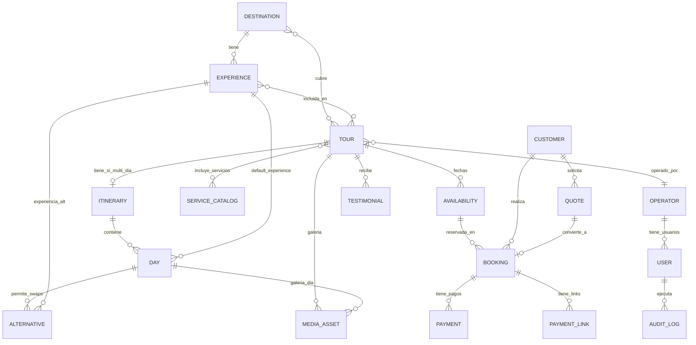

# Random Trips — Modelo de Datos Fase 2 (v2)

> Versión consolidada que reemplaza la v1. Incluye los cambios introducidos por (a) el data real del CMS en `realData.ts`, y (b) el paquete TravelHood Plan 1 que el socio vende a agencias extranjeras.

---

## Resumen ejecutivo

Random Trips opera con un modelo de catálogo jerárquico **Destino → Experiencia**, donde los productos vendibles son **Tours** que pueden ser de día completo (`fijo`), multi-día con o sin alternativas por día (`multi_dia`), o privados por solicitud (`privado_solicitud`). El cobro se hace con depósito fijo no reembolsable + saldo via link de pago manual. Multi-moneda libre (DOP base, USD y EUR derivadas).

## Cambios desde Fase 2 (v1)

| Aspecto | v1 | v2 |
|---|---|---|
| Tipos de tour | `fijo`, `customizable_itinerary`, `multi_dia_tiered`, `privado_solicitud` | `fijo`, `multi_dia`, `privado_solicitud` |
| Customizable vs multi-día fijo | Tipos separados | Mismo tipo `multi_dia`. La diferencia está en si `itinerary[].is_swappable` es true en algún día |
| Pricing tiered | Por rangos de pax (`{min_pax, max_pax, price}`) | Por pax exacto (`{pax, price_per_person}`) con concepto de `base_pax` |
| Depósito | Porcentaje del total | Monto fijo no reembolsable (RD$1,000 default per pax) |
| Servicios incluidos por día | No contemplado | `Day.incluye_text_es/en` como texto libre |
| Pax fuera de rango | No contemplado | Bloqueo de reserva + invitación a cotización custom |
| Logística por tour | Modelado a nivel Tour pero no detallado | `Tour.logistica` con `punto_salida`, `hora_salida`, `maps_url`, `grupo_whatsapp_url` |
| Payment info global | No contemplado | `SiteConfig.payment_info` con banco, titular, cuenta, RNC, depósito default |
| ITBIS | No contemplado | Flag `itbis_incluido` en pricing_model |

---

## 1. Entidades del catálogo

### Destination
Lugar geográfico. Una destinación es padre de muchas experiencias (1:N).

| Campo | Tipo | Notas |
|---|---|---|
| `id` | string | PK |
| `slug` | string | URL-friendly, único |
| `nombre_es`, `nombre_en` | string | Bilingüe |
| `descripcion_es`, `descripcion_en` | string | Bilingüe |
| `lat`, `lng` | string | Coordenadas |
| `galeria_ids[]` | string[] | Refs a MediaAsset |
| `seo_meta_es`, `seo_meta_en` | object | Título y descripción SEO |
| `emoji`, `color` | string | UI helpers (no productivos) |
| `status` | `"published" \| "draft"` | |
| `created_at`, `updated_at` | timestamp | Auditoría |

### Experience
Lugar o actividad concreta. Pertenece a un destino (relación 1:N).

| Campo | Tipo | Notas |
|---|---|---|
| `id` | string | PK |
| `destination_id` | string | FK a Destination |
| `slug` | string | |
| `nombre_es`, `nombre_en` | string | |
| `descripcion_es`, `descripcion_en` | string | |
| `tipo` | string | Playa, Montaña, Aventura, Cultural, Gastronomía, Naturaleza, Acuático |
| `duracion` | string | Texto libre tipo "2 horas", "45 min" |
| `galeria_ids[]` | string[] | |
| `status` | `"published" \| "draft"` | |

**Nota:** En v1 contemplé un `precio_base_por_persona` aquí para alimentar el builder libre. Ya no aplica — el pricing vive en `Tour.pricing_model`. La experiencia es solo componente descriptivo.

### ServiceCatalog
Lista global de servicios que pueden incluirse en un tour. Gestionado desde el CMS por staff.

| Campo | Tipo | Notas |
|---|---|---|
| `id` | string | PK |
| `nombre_es`, `nombre_en` | string | |
| `icono` | string | Emoji o referencia a icon set |
| `categoria` | enum | `transporte`, `alimentacion`, `hospedaje`, `guia`, `seguridad`, `impuestos`, `extras`, `actividad` |
| `orden` | number | Para mostrar en orden consistente |
| `status` | `"active" \| "inactive"` | |

**Servicios mínimos del catálogo V1:**

```
Transporte:    svc-transporte (bus terrestre), svc-transporte-mar (marítimo)
Alimentación:  svc-cafe-agua, svc-almuerzo, svc-desayuno, svc-snacks
Hospedaje:     svc-glamping, svc-hotel
Guía:          svc-staff, svc-guia
Seguridad:     svc-chaleco
Impuestos:     svc-entradas, svc-impuestos-amb
Extras:        svc-fotos, svc-lockers
Actividad:     svc-zipline
```

---

## 2. Tour — la entidad central

### Atributos generales

| Campo | Tipo | Notas |
|---|---|---|
| `id` | string | PK |
| `slug` | string | URL-friendly |
| `titulo_es`, `titulo_en` | string | |
| `descripcion_es`, `descripcion_en` | string | Descripción larga, soporta texto libre |
| `tipo` | `"fijo" \| "multi_dia" \| "privado_solicitud"` | Define UI y reglas |
| `destinos_ids[]` | string[] | Destinos que toca (N:M) |
| `experiencias_ids[]` | string[] | Experiencias que incluye (N:M). En `multi_dia` se deriva de `itinerary[].experiencias_ids` |
| `pricing_model` | object | Ver § 3 |
| `capacidad_max` | number | Pax máximos por salida |
| `deposito_monto_fijo` | number | Default `SiteConfig.payment_info.deposito_fijo_default` (RD$1,000). Por persona. NO reembolsable. |
| `included_services[]` | `{service_id, included, custom_note}[]` | Servicios del tour completo. Para `multi_dia` puede estar vacío si los servicios se listan por día |
| `details` | object | Ver `TourDetails` abajo |
| `itinerary[]` | `Day[]` | Solo si `tipo === "multi_dia"`. Ver § 4 |
| `logistica` | object | Ver § 5 |
| `galeria_ids[]` | string[] | |
| `operador_id` | string | FK a Operator |
| `categorias[]` | string[] | UI tags |
| `tags[]` | string[] | UI tags |
| `estado` | `"publicado" \| "borrador" \| "archivado"` | |

### TourDetails (embedded)

| Campo | Tipo |
|---|---|
| `duracion` | string libre (ej: "Full day", "7 días / 6 noches") |
| `idiomas[]` | string[] (ej: ["Español", "Inglés"]) |
| `cuando_reservar` | string libre |
| `tipo_bono` | `"electrónico" \| "físico"` |
| `accesibilidad` | string libre |
| `mascotas_permitidas` | boolean |
| `edad_minima` | number? |
| `dificultad` | `"Baja" \| "Moderada" \| "Moderada-Alta" \| "Alta"` |
| `sostenibilidad_nota` | string libre |

---

## 3. Pricing models

`Tour.pricing_model` es un objeto discriminado por `type`. Tres modos en V1:

### Modo A — `fixed_per_person`
Precio lineal por persona. Caso de uso: tours de día (Playa Frontón a RD$3,500/p).

```ts
{
  type: "fixed_per_person",
  price_per_person: 3500,
  currency: "DOP",
  itbis_incluido: false
}
```

**Cálculo:** `total = price_per_person × pax`

### Modo B — `tiered_per_pax`
Precio por persona varía según la cantidad **exacta** de pax. Hay un `base_pax` sobre el cual se calcula el "precio principal" mostrado en marketing. Caso de uso: paquetes multi-día como TravelHood.

```ts
{
  type: "tiered_per_pax",
  base_pax: 10,
  base_price_per_person: 40344,
  currency: "DOP",
  itbis_incluido: true,
  tiers: [
    { pax: 6,  price_per_person: 51612 },
    { pax: 7,  price_per_person: 46113 },
    { pax: 8,  price_per_person: 43611 },
    { pax: 9,  price_per_person: 41796 },
    { pax: 11, price_per_person: 37868 },
    { pax: 12, price_per_person: 35806 }
  ],
  min_pax: 6,
  max_pax: 12
}
```

**Cálculo:**
1. Buscar tier donde `tier.pax === pax_solicitado` (o el `base_pax` si pax === base_pax)
2. Si no existe: el cliente NO puede reservar. Mostrar mensaje invitando a cotización custom.
3. `total = tier.price_per_person × pax`

**Comportamiento si `pax < min_pax || pax > max_pax`:** bloqueo de reserva. UI muestra:
> "Este paquete está disponible para grupos de {min_pax}-{max_pax} personas. ¿Eres un grupo más grande o más pequeño? **[Solicitar cotización personalizada →]**"

### Modo C — `fixed_group`
Precio total fijo, independiente del número de personas (siempre que no supere `max_pax`).

```ts
{
  type: "fixed_group",
  total_price: 25000,
  max_pax: 8,
  currency: "DOP",
  itbis_incluido: false
}
```

**Cálculo:** `total = total_price` (sin multiplicar por pax).

---

## 4. Day — la estructura del itinerario

Solo presente cuando `Tour.tipo === "multi_dia"`. Es un array `Tour.itinerary[]`.

| Campo | Tipo | Notas |
|---|---|---|
| `day_number` | number | Posición (1, 2, 3...). Permite agrupar (ej: día 6-7 como un solo bloque) |
| `title_es`, `title_en` | string | Bilingüe (ej: "Día 1 — Santo Domingo") |
| `description_es`, `description_en` | string | Bilingüe, texto libre |
| `destinos_ids[]` | string[] | Destinos visitados ese día |
| `experiencias_ids[]` | string[] | Experiencias visitadas ese día (opcional, complementa el texto) |
| `incluye_text_es`, `incluye_text_en` | string | Texto libre con los servicios incluidos ese día. Se muestra tal cual en la web pública |
| `is_swappable` | boolean | Si el cliente puede cambiar este día por una alternativa |
| `alternatives[]` | `Alternative[]` | Solo si `is_swappable === true`. Ver abajo |
| `galeria_ids[]` | string[] | Imágenes del día (opcional) |

### Alternative (cuando `is_swappable === true`)

| Campo | Tipo | Notas |
|---|---|---|
| `experience_id` | string | Experiencia alternativa del catálogo |
| `price_delta_per_person` | number | Delta en DOP que se suma/resta al precio base por cada pax. Puede ser 0, positivo o negativo |

**Cálculo del total con swaps:**

```
total = pricing_model.calcular(pax) + Σ(alternativa_elegida.price_delta_per_person) × pax
```

**Reglas de compatibilidad:** las alternativas listadas en cada día ya están **pre-validadas como compatibles** por el staff (curaduría implícita). No hay motor de reglas cross-día en V1.

---

## 5. Logística y SiteConfig

### `Tour.logistica` (embedded)

| Campo | Tipo |
|---|---|
| `punto_salida` | string libre |
| `hora_salida` | string libre (ej: "5:00 A.M (puntual)") |
| `maps_url` | string (link Google Maps) |
| `grupo_whatsapp_url` | string? (se comparte una semana antes con el grupo) |

### `SiteConfig` (singleton)

```ts
{
  contacto: {
    whatsapp: "+1 (849) 589-2057",       // principal (formularios/reservas)
    whatsapp_secundario: "+1 (809) 601-6082", // flyers Instagram
    email: "info@randomtrips.co"
  },
  redes: {
    instagram: "@randomtrips.co",
    facebook: null,
    tiktok: null,
    youtube: null
  },
  tasas_cambio: {
    base: "DOP",
    USD: 0.0167,
    EUR: 0.0155,
    actualizado_en: timestamp,
    actualizado_por: user_id
  },
  punto_salida_default: {
    nombre: "Bon Plaza Paraíso",
    direccion: "Av. Winston Churchill, Santo Domingo",
    maps_url: "https://share.google/ic18n9Gy6v6j9NLjL"
  },
  payment_info: {
    banco: "Banreservas",
    titular: "RANDOM TRIPS S.R.L.",
    tipo_cuenta: "Cuenta corriente",
    numero_cuenta: "9609086703",
    rnc: "133540118",
    deposito_fijo_default: 1000,        // RD$ por persona
    nota_deposito: "Este monto de apartado no es reembolsable."
  }
}
```

---

## 6. Disponibilidad y reservas

### Availability

| Campo | Tipo |
|---|---|
| `tour_id` | string FK |
| `fecha` | date ISO |
| `cupos_totales` | number |
| `cupos_reservados` | number |
| `cupos_libres` | number (derivado) |
| `estado` | `"abierto" \| "bloqueado" \| "completado" \| "completado_finalizado"` |
| `precio_override` | object? | Permite sobrescribir el pricing_model para esa fecha (ej: tarifa de temporada) |

### Booking

| Campo | Tipo | Notas |
|---|---|---|
| `id` | string | PK |
| `customer_id` | string FK | |
| `tour_id` | string FK | |
| `fecha` | date | |
| `pax_total` | number | |
| `pax_detalle` | object? | `{adultos, niños, infantes}` si aplica |
| `precio_total` | number | En moneda elegida |
| `moneda` | `"DOP" \| "USD" \| "EUR"` | Moneda elegida por el cliente |
| `deposito_pagado` | number | |
| `saldo_pendiente` | number | |
| `estado` | enum | `pendiente_pago`, `deposito_pagado`, `pagado_completo`, `saldo_vencido`, `cancelada`, `finalizada` |
| `operador_id` | string FK | |
| `source` | `"web" \| "quote" \| "manual"` | Origen de la reserva |
| `itinerary_config[]` | `{day_number, selected_experience_id}[]`? | Solo si el tour es multi_dia con swaps. Registra qué eligió el cliente |
| `notas_internas` | string | Solo visible en CMS |
| `created_at`, `updated_at` | timestamp | |

### Payment y PaymentLink

```ts
Payment {
  booking_id, tipo: "deposito" | "saldo" | "reembolso",
  monto, moneda, paypal_txn_id, estado, fecha
}

PaymentLink {
  booking_id, monto, moneda, paypal_invoice_id,
  expira_en, estado: "pendiente" | "enviado" | "pagado" | "vencido",
  recordatorios: timestamp[]
}
```

### Quote (cotización custom)

```ts
Quote {
  id, contacto: {nombre, email, telefono, pais},
  destinos_solicitados[], fechas_solicitadas,
  pax, presupuesto_aproximado?, mensaje,
  estado: "pendiente" | "enviada" | "aceptada" | "rechazada",
  precio_propuesto?, moneda, link_pago_id?,
  asignado_a: user_id, notas_staff,
  created_at, responded_at
}
```

---

## 7. Personas y operadores

### Customer
```ts
{
  id, email, nombre, telefono, pais,
  idioma_preferido: "ES" | "EN",
  moneda_preferida: "DOP" | "USD" | "EUR",
  paypal_customer_id?,
  created_at
}
```

### Operator
```ts
{
  id, tipo: "interno" | "externo",
  nombre, contacto: {email, telefono, whatsapp},
  tours_asignados_ids[],
  estado: "activo" | "inactivo",
  // commission_percentage queda fuera de V1 (manejo externo)
}
```

### User (CMS)
```ts
{
  id, email, nombre, rol: "admin" | "staff" | "operador",
  operator_id?,    // solo si rol = operador
  permisos[]?,     // overrides granulares opcionales
  ultimo_login,
  estado: "activo" | "inactivo"
}
```

---

## 8. Contenido

### MediaAsset
```ts
{
  id, tipo: "foto" | "video", url, thumb_url?,
  alt_es, alt_en,
  asociacion: "destino" | "experiencia" | "tour" | "global",
  asociado_a: id,
  dimensiones, peso, created_at
}
```

### Testimonial
```ts
{
  id, cliente_nombre, tour_id?,
  contenido_es, contenido_en, rating: 1-5,
  foto_url?, fecha,
  aprobado: boolean, orden
}
```

### FAQ
```ts
{
  id, categoria, pregunta_es, pregunta_en,
  respuesta_es, respuesta_en, orden, estado
}
```

### Page (páginas estáticas)
```ts
{
  id, slug, titulo_es, titulo_en,
  contenido_es, contenido_en, // rich text/markdown
  estado, seo_meta
}
```

Páginas mínimas del CMS V1: Sobre nosotros, Políticas de Cancelación, Normas del Tour, Proceso de Inscripción, Términos y Condiciones, Privacidad.

---

## 9. Sistema

### AuditLog (patrón Simlimites)
```ts
{
  id, timestamp, actor_id (user.id),
  accion: "create" | "update" | "delete" | "publish" | ...,
  entidad: string (ej: "tour", "booking", "destination"),
  entidad_id, antes: json, despues: json,
  ip?, user_agent?
}
```

---

## 10. Diagrama de relaciones



---

## 11. Casos de uso de referencia

### Caso 1 — Tour fijo de un día (Playa Frontón)
```ts
{
  tipo: "fijo",
  destinos_ids: ["dest-samana"],
  experiencias_ids: ["exp-playa-fronton", "exp-playa-madama", "exp-piscina-natural", ...],
  pricing_model: { type: "fixed_per_person", price_per_person: 3500, currency: "DOP" },
  itinerary: null,
  deposito_monto_fijo: 1000
}
```

### Caso 2 — Multi-día con días swappeables (futuro paquete personalizable)
```ts
{
  tipo: "multi_dia",
  pricing_model: { type: "tiered_per_pax", base_pax: 6, ... },
  itinerary: [
    { day_number: 1, is_swappable: false, ... },
    { day_number: 2, is_swappable: true, alternatives: [...] },
    { day_number: 3, is_swappable: true, alternatives: [...] },
    { day_number: 4, is_swappable: false, ... }
  ]
}
```

### Caso 3 — Multi-día cerrado vendido a agencias (TravelHood Plan 1)
```ts
{
  tipo: "multi_dia",
  pricing_model: {
    type: "tiered_per_pax",
    base_pax: 10,
    base_price_per_person: 40344,
    min_pax: 6, max_pax: 12,
    itbis_incluido: true,
    tiers: [/* 6→51612, 7→46113, ..., 12→35806 */]
  },
  itinerary: [
    { day_number: 1, title: "Santo Domingo", is_swappable: false, ... },
    { day_number: 2, title: "Puerto Plata", is_swappable: false, ... },
    { day_number: 3, title: "Río San Juan", is_swappable: false, ... },
    { day_number: 4, title: "Frontón", is_swappable: true, alternatives: [/* a definir */], ... },
    { day_number: 5, title: "Las Terrenas", is_swappable: true, alternatives: [], ... },
    { day_number: 6, title: "Sur Profundo + Bahía Águilas", is_swappable: false, ... }
  ]
}
```

### Caso 4 — Privado por solicitud
```ts
{
  tipo: "privado_solicitud",
  pricing_model: null,
  itinerary: null,
  // No vendible directamente desde la web. Solo formulario → Quote
}
```

---

## 12. Scope V1 vs backlog

**V1 (incluido):**
- Catálogo: Destination, Experience, Tour (3 tipos), ServiceCatalog
- 3 modos de pricing con cálculo en vivo
- Itinerario multi-día con days swappeables
- Depósito fijo no reembolsable + links de pago manual con recordatorios
- Multi-idioma ES/EN, multi-moneda DOP/USD/EUR (selector libre)
- Auth de clientes, "Mi cuenta"
- CMS completo (admin/staff) + vista limitada de operador
- PayPal como única pasarela
- Testimonios curados, FAQ, páginas estáticas
- AuditLog
- Mensaje "fuera de rango → solicitar cotización" para tiered

**Backlog (V2+):**
- Cupones y descuentos
- Blog (CMS de contenidos)
- Programa de referidos
- Pasarelas locales (Azul/Cardnet)
- Pagos recurrentes automáticos (PayPal Billing Agreement)
- Módulo de comisiones y liquidaciones para operadores
- Reviews post-tour del cliente
- Portal B2B (proyecto separado, consume de esta BD)
- Motor de reglas cross-día para swaps complejos
- Analytics avanzados de servicios incluidos

---

## 13. Decisiones consolidadas (referencia rápida)

1. **Moneda base de almacenamiento:** DOP. USD y EUR derivadas de tasas en SiteConfig.
2. **Cliente elige moneda libremente** en el header y se mantiene en checkout.
3. **Experiencia ↔ Destino:** 1:N (una experiencia pertenece a un solo destino).
4. **Experiencias no se venden sueltas** — son componentes de un Tour.
5. **Pricing tiered es por pax exacto**, no por rangos. Con `base_pax` para el "precio principal" mostrado.
6. **Depósito = monto fijo no reembolsable** (RD$1,000 default per pax), no porcentaje del total.
7. **Pagos de saldo: links manuales + recordatorios automáticos** (no autorización recurrente).
8. **Comisión de operadores externos: fuera del sistema** en V1.
9. **Reglas de swaps: implícitas por curaduría** del staff (no motor cross-día).
10. **Reviews curados desde CMS** (cliente no postea directo).
11. **Fuera de rango pax → bloqueo + invitación a cotización custom.**
12. **Servicios incluidos por día: texto libre** (`incluye_text_es/en`), no estructurado.
13. **ITBIS:** se modela como flag `itbis_incluido` en pricing_model. No se calcula automáticamente, se asume que el precio ya lo trae si el flag es true.

---

## 14. Próximos pasos

Este documento cierra **Fase 2**. La siguiente fase es:

**Fase 4 — Arquitectura backend:**
- Diseño AWS Serverless (API Gateway + Lambda + DynamoDB + S3 + CloudFront + Cognito + SES + EventBridge + Step Functions)
- DynamoDB single-table con PK/SK y GSIs documentados
- Access patterns por cada caso de uso (mínimo 20-30 patterns)
- Contratos de API (REST endpoints o tRPC)
- Workflows asíncronos: confirmación, recordatorios, post-tour
- Integración PayPal (depósitos + invoicing)
- Auth con Cognito (grupos admin/staff/operador/customer)
- Estimación de costos AWS por volumen esperado
- Roadmap de implementación por sprints

Antes de pasar a Fase 4, cerrar las iteraciones pendientes del CMS en Figma Make (itinerario multi-día, pricing tiered UI, handlers vacíos, data faltante de cotizaciones/operadores/usuarios CMS/auditoría).
